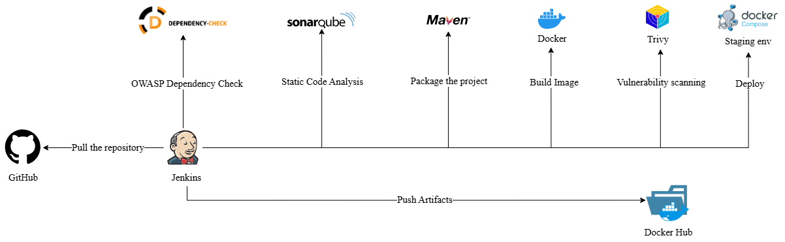

# Spring Boot CI/CD Pipeline with Jenkins

This repository contains a sample Spring Boot application integrated with a CI/CD pipeline using Jenkins. The pipeline automates the build, test, and deployment processes, including OWASP Dependency Check, SonarQube Analysis, Docker image creation, vulnerability scanning, and deployment to a staging environment.

## Technologies Used

- Jenkins (CI/CD orchestration)
- Spring Boot (Application framework)
- Maven (Build automation)
- OWASP Dependency Check (Security scanning)
- SonarQube (Code quality analysis)
- Docker (Containerization)
- Trivy (Container security scanning)
- Docker Compose (Container orchestration)

## Pipeline Stages
The CI/CD pipeline follows these key stages:  



1. **Code Checkout**
   - Clones repository from GitHub
   - Branch: main

2. **OWASP Dependency Check**
   - Scans all project dependencies
   - Generates HTML report

3. **SonarQube Analysis**
   - Performs static code analysis
   - Checks code quality

4. **Build and Package**
   - Cleans workspace
   - Compiles code
   - Creates JAR file

5. **Docker Build and Push**
   - Builds Docker image
   - Tags with build number and latest
   - Pushes to Docker Hub

6. **Vulnerability Scanning**
   - Scans Docker image with Trivy
   - Checks for security vulnerabilities

7. **Staging Deployment**
   - Deploys using Docker Compose
   - Sets up application stack
  
   
## Prerequisites

- Java JDK 17
- Maven 3.x
- Docker and Docker Compose
- SonarQube Server
- Git

## Installation and Setup

### Jenkins Configuration

1. Install required Jenkins plugins:
   - Docker Pipeline
   - SonarQube Scanner
   - OWASP Dependency-Check
   - Git

2. Configure Jenkins tools:
```groovy
tools {
    jdk 'jdk17'
    maven 'maven3'
}
```

3. Add credentials:
   - GitHub credentials (if repository is private)
   - DockerHub credentials
   - SonarQube token

### SonarQube Setup

1. Install and start SonarQube server:
```bash
docker run -d --name sonarqube -p 9000:9000 sonarqube:latest
```

2. Configure SonarQube project:
   - Create new project
   - Generate authentication token
   - Add token to Jenkins credentials

### Docker Configuration

1. Install Docker and Docker Compose
2. Configure Docker Hub authentication
